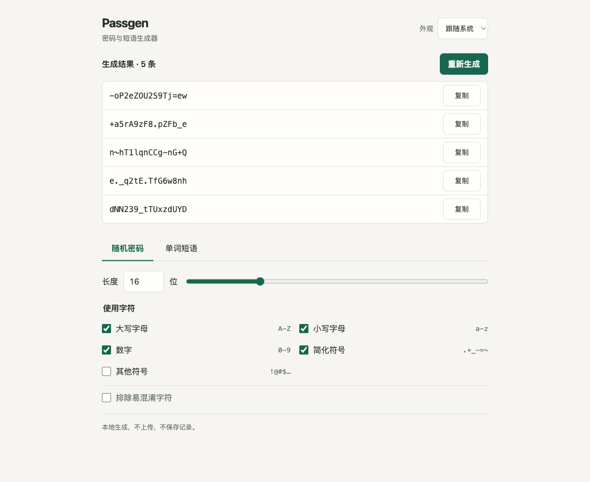

# Passgen

按你的需要，随手生成一组密码或单词短语。

下载 [passgen.html](https://github.com/VaneEcho/passgen/raw/refs/heads/main/passgen.html)，用浏览器打开。只有这一个文件，不用安装，断网也能用。

选长度、选字符，点一下复制。短一点、纯数字，或几个单词连起来，都由你决定。

代码：[MIT](LICENSE)。词库：[EFF](https://www.eff.org/dice)，[CC BY 4.0](https://creativecommons.org/licenses/by/4.0/)。
